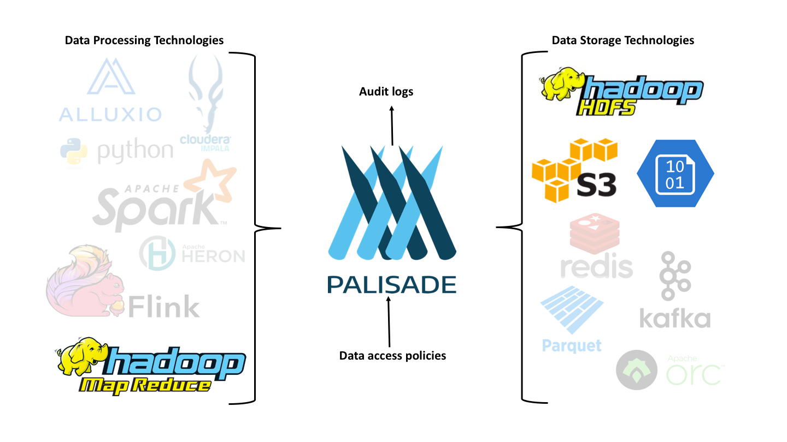

<!---
Copyright 2020 Crown Copyright

Licensed under the Apache License, Version 2.0 (the "License");
you may not use this file except in compliance with the License.
You may obtain a copy of the License at

  http://www.apache.org/licenses/LICENSE-2.0

Unless required by applicable law or agreed to in writing, software
distributed under the License is distributed on an "AS IS" BASIS,
WITHOUT WARRANTIES OR CONDITIONS OF ANY KIND, either express or implied.
See the License for the specific language governing permissions and
limitations under the License.
--->

# 
###A Tool for Complex and Scalable Data Access Policy Enforcement

Palisade aims to provide a stable framework for defining and enforcing policies for accessing data.

####Introduction
Modern organisations can have multiple datasets that are each managed and accessed according to different policies and procedures. This can make it complicated for analysis while still ensuring reglatory compliance.  Most technologies "out of the box" do not provide the necessary solution for managing these complex issues for data access. This leads to data being siloed and often accesses being restricted with the outcome that the insight from data can be lost.   

Palisade can provide a solution to this problem.  It consists of a set of services for managing and enforcing complex data access policies across different datasets and platforms.  These services are able to provide modular data access controllers and independent peripheral services to allow policies to be integral to the process a client uses to access data.  

Consider the example of a set of datasets may have been assembled for specific purposes.   For a given dataset, only particular types of query are permitted for certain types of user.  Also, within each dataset a specific user may only be permitted to access a particular subset of the records. Palisade allows the policies for accessing datasets, redacting records and executing the query to be specified independently of the physical data and the platform hosting the data.  This will enable the clients to perform queries across the datasets while still conforming to company and regulatory policies.  

Policies are set per resource and are not changed by the user or context.  However, the policies can use the information about the user and context to decide how the data needs to be sanitised for this particular query.  This can be applied on a per field basis. This means that fields in a record can be redacted or masked based on: the contents of the record; the user accessing the record; and the contextual information given by the user or the system at the time of the query.

Palisade's aim is to provide a stable framework for defining and enforcing policy and auditing requirements for data access requests while at the same time, not limiting the solution any one platform ecosystem.  This will allow Palisade to be adapted into existing solutions that already do work in the different ecosystems such as Hadoop, Kubernetes, AWS, Azure, Google.io, etc.  Palisade does that by sharing with the community the task of creating connectors to new data storage technologies and the connectors from new data processing technologies into Palisade. 

If required, Palisade allows an organisation to use centralised services which each deployment of Palisade's data access services can share. This means that your data access policies, audit logs, user account details etc. don't need to be duplicated on every system. Of course, Palisade can still be deployed locally on a per platform basis.

###Additional Information 

For more information on Palisade, [take a look here](https://gchq.github.io/Palisade/doc/developer_guide.html).

For any questions or help please contact using the GitHub Issue tracking system.  Go to the Issue page and create and enter your query in a new issue and then submit.  We will try to respond as quick as possible in the form of a comment to the issue.  Here is the link to [Palisade issues](https://gchq.github.io/Palisade/issues).

## Status
Palisade is still in the early stages of development and is not production ready.  This information will be updated when there is a scheduled date for the production release.

### License
Palisade is licensed under the [Apache 2.0 License](https://www.apache.org/licenses/LICENSE-2.0) and is covered by [Crown Copyright](https://www.nationalarchives.gov.uk/information-management/re-using-public-sector-information/copyright-and-re-use/crown-copyright/).
