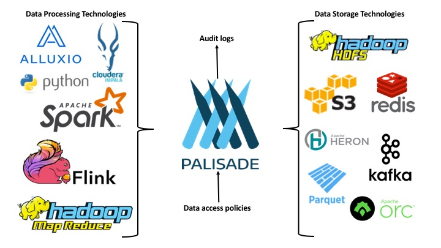

<!---
Copyright 2018 Crown Copyright

Licensed under the Apache License, Version 2.0 (the "License");
you may not use this file except in compliance with the License.
You may obtain a copy of the License at

  http://www.apache.org/licenses/LICENSE-2.0

Unless required by applicable law or agreed to in writing, software
distributed under the License is distributed on an "AS IS" BASIS,
WITHOUT WARRANTIES OR CONDITIONS OF ANY KIND, either express or implied.
See the License for the specific language governing permissions and
limitations under the License.
--->

# 

#### Scalable Data Policy Management and Application

## Status

Palisade is still in the early stages of development.
At the moment there are just a few simple implementations to show how Palisade could work - it is not production ready.
The descriptions of Palisade below indicate the high level goals of the framework. 

### Complex data policies

Modern data organisations store lots of datasets that are each managed and accessed according to different data policies. These policies can be complicated and it can be difficult to store and access datasets for analysis across different technologies while ensuring compliance.

Most technologies don't provide the necessary hooks out of the box for managing these complex data policies. This leads to data being siloed or accesses and APIs being restricted and insight from data is lost. 

Palisade is a set of services for managing and applying complex data policies across different scales and platforms. It provides modular data access controllers and independent, peripheral services to allow policies to be applied before clients access the data.  

For example, datasets may have been assembled for specific purposes and, for a given dataset, only particular types of query are permitted for certain types of user. Also, within each dataset a specific user may only be permitted to access a particular subset of the records. Palisade allows the policy for accessing datasets, redacting records and executing the query to be specified independently of the physical data and the platform hosting the data.

Policies can be applied on a per item basis. This means that items (e.g. cells) in a record can be redacted or masked based on the contents of the record, the user accessing the record and the justification given for the query.

When a user submits a query (or executes some analytic code), Palisade uses the local information about the user, the platform and the data requested to look up the relevant data policy. This policy is then used by a process, which ideally should be data-local process to get the best performance, to return only the records that are allowed by the policy for the specific user, dataset and query justification. 

### Multi-platform compatibility

Palisade aims to provide a stable framework for defining and applying policy and auditing requirements to data access requests while allowing you to keep up with the fast-changing world of data science tools. Palisade does that by sharing the burden of creating connectors to new data storage technologies and the connectors from new data processing technologies into Palisade. Palisade is not dependant on any platform ecosystem such as Hadoop, Kubernetes, AWS, Azure, google.io, etc. 

### Centralised or Local Policy

If required, Palisade allows an organisation to use centralised services which each deployment of Palisade's data access services can share. This means that your data access policies, audit logs, user account details etc. don't need to be set up duplicated on every system. Of course, Palisade can be deployed locally on a per platform basis.

## Licence
Palisade is licensed under the Apache 2 license.

## Getting started

To get started, clone the Palisade repo: 

`git clone https://github.com/gchq/Palisade.git`

We have two simple examples that demonstrate the automated auditing and policy rule enforcement when users read some data. 
These example should provide a good start to understanding how Palisade works.

* To run the single-jvm-example module follow this guide: [single-jvm-example](example/single-jvm-example/README.md)

* To run the REST based example follow this guide: [multi-jvm-example](example/multi-jvm-example/README.md)

For more details about the code structure see the [Developer Guide](doc/developer_guide.md)

For details about possible use cases, see the [Use Cases](doc/use_cases.md)

## Contributing

We welcome contributions to the project. Detailed information on our ways of working can be found [here](doc/other/ways_of_working.md). In brief:

* Sign the [GCHQ Contributor Licence Agreement](https://github.com/gchq/Gaffer/wiki/GCHQ-OSS-Contributor-License-Agreement-V1.0);
* Push your changes to a fork;
* Submit a pull request.

## FAQ

* What versions of Java are supported? Java 8 with plans to upgrade to Java 11+ soon.

