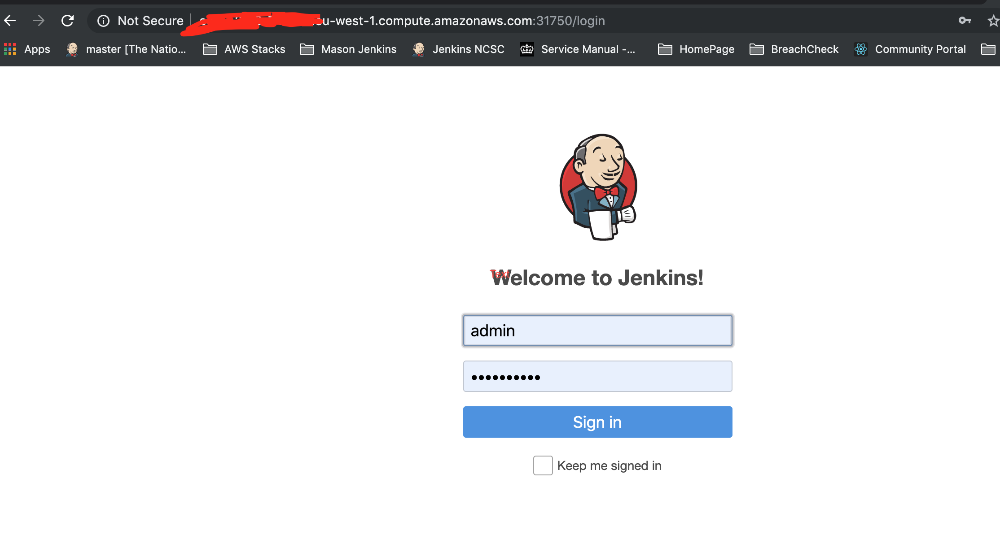

# Creating a Jenkins instance running under Kubernetes on AWS on an EC2 instance

## Inital setup
1. Create an EC2 instance / start with a Ubuntu Server 18.04 LTS
1. In the case of AWS choose a sufficiently large EC2 instance (t2.xlarge)
1. Configure Instance Details - set auto assign public IP
1. Configure security group to select SSH access for ports 22 and 31750 from your ip address
1. Configure an existing key pair to access
1. Click on launch instance
1. Create an elastic block store volume (80GB) and note down the Volume ID 
1. Connect to the EC2 instance as follows and select yes:
```bash
ssh -i "your pem.pem" ubuntu@ec2-XX-XXX-XXX-XX.eu-west-1.compute.amazonaws.com
```


## Package Installation

### Mount the EBS backed volume into the EC2 instance
1. Follow this guide: https://docs.aws.amazon.com/AWSEC2/latest/UserGuide/ebs-using-volumes.html to ensure that the EBS volume is mounted. The location mount point should be /ebs-data
1.  N.B The above guide will leave group and user permissions for the folder: /ebs-data as root:root. To correct this add the following lines at the end of the .bashrc:
```bash
sudo chown ubuntu:ubuntu /ebs-data
```
Run the following command to ensure the ebs directory is mounted correctly:
```bash
df -h | grep ebs-data
```


### Install Microk8s, Docker and Helm
MicroK8s is a snap lightweight kubernetes implementation: https://microk8s.io/docs/
Run the following commands to install microk8s and verify that it's working:

```bash
sudo snap install microk8s --classic
microk8s.kubectl get nodes
microk8s.kubectl get services
sudo snap alias microk8s.kubectl kubectl
kubectl get nodes
```

Check the status of the microk8s cluster:
```bash
microk8s.status
microk8s is running
addons:
knative: disabled
jaeger: disabled
fluentd: disabled
gpu: disabled
storage: disabled
registry: disabled
rbac: disabled
ingress: disabled
dns: disabled
metrics-server: disabled
linkerd: disabled
prometheus: disabled
istio: disabled
dashboard: disabled
```
We will now enable the storage and dns add ons:

```bash
microk8s.enable storage
microk8s.enable dns

```

Rerun microk8s.status and ensure that storage and dns are now enabled


Install Docker
```bash
sudo snap install docker
```

Install Helm
```bash
sudo snap install helm --classic
```

Run Helm init to install Tiller:
```bash
helm init
```

### Jenkins configuration
Copy the following files from the repo into /home/ubuntu
jenkins-chart.yaml
jenkins-pv.yaml
jenkins-pvc.yaml
values.yaml

Edit jenkins-pv.yaml and change the volume id to that saved above

Run the following:

```bash
kubectl apply -f jenkins-pv.yaml
kubectl apply -f jenkins-pvc.yaml
kubectl get pv
NAME                                       CAPACITY   ACCESS MODES   RECLAIM POLICY   STATUS      CLAIM                 STORAGECLASS        REASON   AGE
jenkins-pv                                 5Gi        RWO            Retain           Available                         standard                     5h50m
pvc-8c50eba5-9703-4e00-b2b3-xxxxxxxxxxxx   4Gi        RWO            Delete           Bound       default/jenkins-pvc   microk8s-hostpath            5h50m
```


Run the following which will enable Jenkins:

```bash
helm install --name jenkins -f jenkins-chart.yaml stable/jenkins --values values.yaml
```

wait for the pods to come into service:

```bash
kubectl get pods
NAME                       READY   STATUS    RESTARTS   AGE
jenkins-68f54d45fb-fkl4s   1/1     Running   0          79m
```

Run the following to get the connetion details:

```bash
kubectl get secret --namespace default jenkins -o jsonpath="{.data.jenkins-admin-user}" | base64 --decode; echo
kubectl get secret --namespace default jenkins -o jsonpath="{.data.jenkins-admin-password}" | base64 --decode; echo
export NODE_PORT=$(kubectl get --namespace default -o jsonpath="{.spec.ports[0].nodePort}" services jenkins)
export NODE_IP=$(kubectl get nodes --namespace default -o jsonpath="{.items[0].status.addresses[0].address}")
echo http://$NODE_IP:$NODE_PORT/login
```

You should now be able to access the jenkins server 

