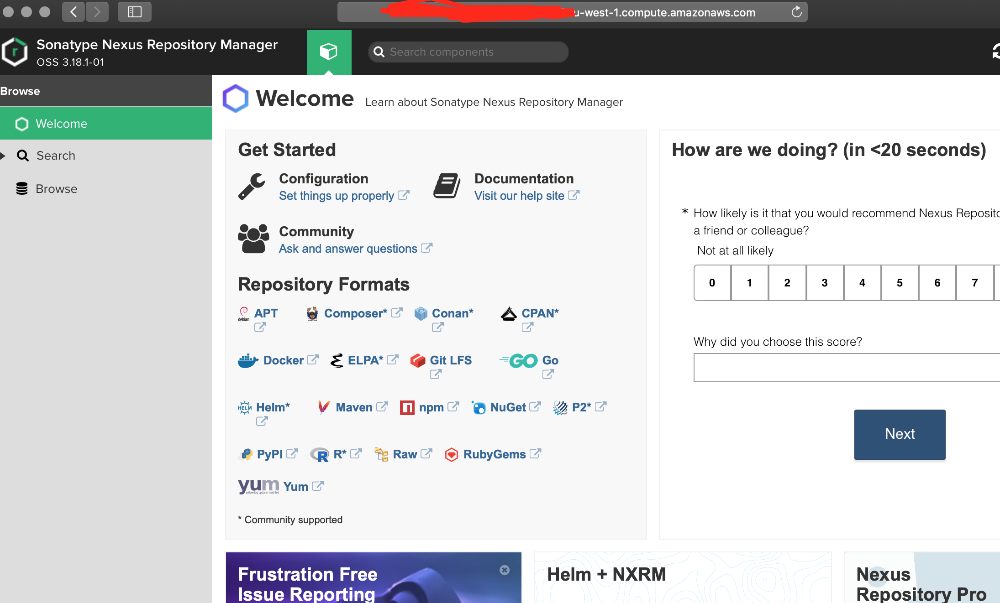

# Creating a Nexus repository instance running under Kubernetes on AWS on an EC2 instance

1. Follow the Initial Setup shown in [Jenkins installation](../jenkins/README.md) - the Nexus repository and Jenkins instance share the same EC2 instance.

### Nexus configuration
Copy the following files and folders from the repo into /home/ubuntu/nexus
1. nexus-pod.yaml
1. nexus-service.yaml
1. nexuschart

#### Folder permissions, UID and GID
Nexus runs at userID=200 and GroupID=200. In order to allow Nexus to write to the data volume, the user and group need to be created:
Run the following commands:

```bash
sudo groupadd nexus -g 200
sudo useradd nexus -u 200 -g 200
mkdir /ebs-data/nexus
sudo chown nexus:nexus /ebs-data/nexus
sudo chmod 775 /ebs-data/nexus
```


#### Launching Nexus
Run the following commands:
```bash
cd ~/nexus
helm install nexuschart --name=nexusup
```

Helm will launch Nexus as a separate service. If all is well you will be able to curl to the nexus redirected command port:

```bash
curl localhost:31751
```

Configure the security group associated with your EC2 instance to expose port 31751 to your IP address.

In a browser visit the following URL:

```bash
http://<EC2 public IP address>:31751
```

You should see the following:

