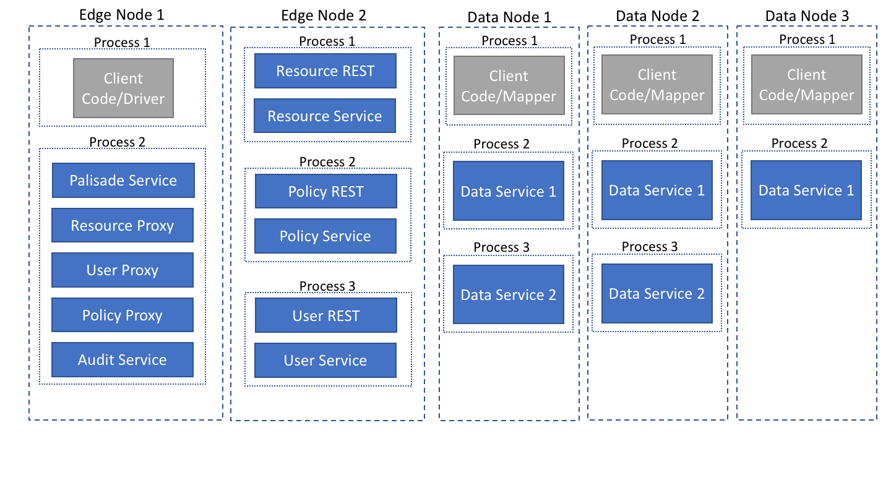
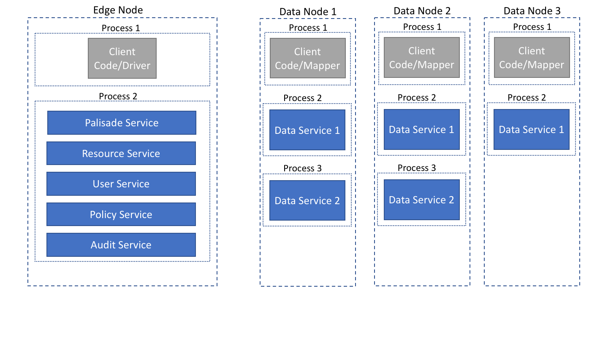

<!---
Copyright 2020 Crown Copyright

Licensed under the Apache License, Version 2.0 (the "License");
you may not use this file except in compliance with the License.
You may obtain a copy of the License at

  http://www.apache.org/licenses/LICENSE-2.0

Unless required by applicable law or agreed to in writing, software
distributed under the License is distributed on an "AS IS" BASIS,
WITHOUT WARRANTIES OR CONDITIONS OF ANY KIND, either express or implied.
See the License for the specific language governing permissions and
limitations under the License.
--->

## How might the system be deployed?

#### Micro-service deployment using REST APIs
  
This deployment shows how you might have a Palisade service that can use a local audit service component but uses proxies to ask other micro-services for the other information that it requires.
Those other micro-services could be running on different VMs/machines.

#### Monolith deployment
  
This deployment shows that the design works if you want to have all of your services running in the same JVM.
This deployment might be useful for instance, in integration test scenarios.

