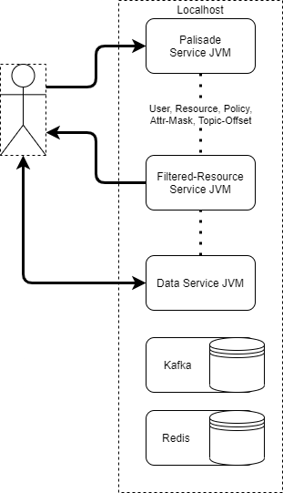

<!---
Copyright 2018-2021 Crown Copyright

Licensed under the Apache License, Version 2.0 (the "License");
you may not use this file except in compliance with the License.
You may obtain a copy of the License at

  http://www.apache.org/licenses/LICENSE-2.0

Unless required by applicable law or agreed to in writing, software
distributed under the License is distributed on an "AS IS" BASIS,
WITHOUT WARRANTIES OR CONDITIONS OF ANY KIND, either express or implied.
See the License for the specific language governing permissions and
limitations under the License.
--->

# Deployments

## How might the system be deployed?

#### Kubernetes (Locally or AWS EKS)

\* _Service in this case means K8s `Service` resource, which acts as an in-cluster DNS name._

Palisade primarily supports deployment through `helm` to a K8s cluster.
This allows for containerisation, scaling and auto-recovery on service failure.
Palisade is regularly deployed to local k8s clusters for manual developer testing, and to AWS EKS for CI/CD automated testing.

In this deployment, containers for each microservice are managed by various K8s workload resources, notably `Deployment`s and `Statefulset`s.
These can then be scaled up or down as appropriate, with the optional metrics-server responsible for horizontal auto-scaling.

The Palisade services are accessed through a Traefik ingress, which is installed into the `kube-system` namespace rather than with the rest of the Palisade services (the `palisade` namespace in this diagram).
Each microservice is responsible for its own volume mounts, configuration, and ingress-route if any.

Redis and Kafka can be either installed into the same namespace as the Palisade services, or in a separate namespace not managed by Palisade (the `shared-infra` in this diagram).

#### JVM Processes

Palisade also supports running as bare JVM processes outside of K8s, but of course without any of the benefits provided by K8s.
The [quickstart.cmd script](/quickstart.cmd) runs using this approach, as it does not depend on availability of a cluster, as well as offering slightly faster startup times.
This is intended as a proof-of-concept and for lighter-weight testing, rather than as a production-ready deployment.

In this deployment, a separate JVM is spawned for each microservice and will run unmanaged.
This means services will not recover from crashes or critical errors.

The Palisade services are accessed through their localhost address and port.
Each microservice uses the local filesystem without any additional volume mounts.

_n.b.Redis and Kafka are still required in some form, whether exposed in a local k8s cluster, running as local processes, or hosted externally as a SaaS_.
