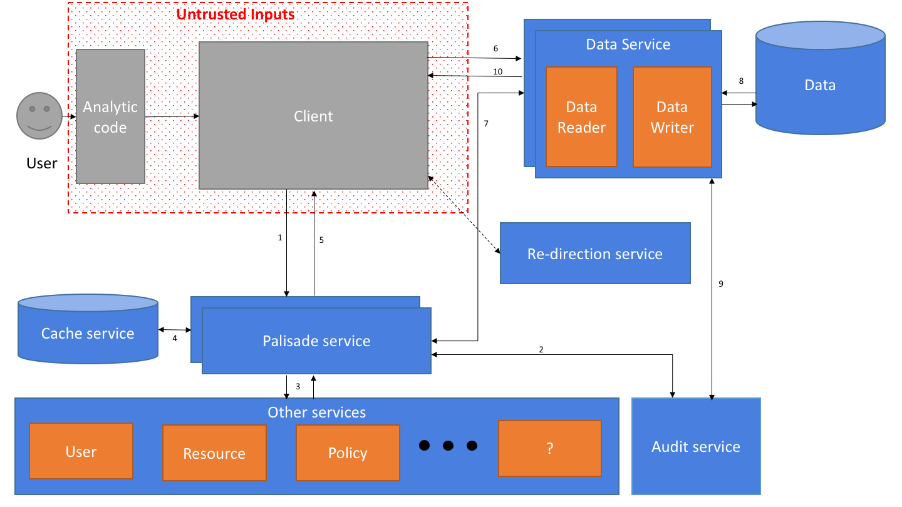

## Description of each component

### Client code
The job of the client code is to send the request for data into Palisade and to interpret the result as required for the data processing technology it is written for.
The responsibility for implementations of the client code is to provide users with a way to request data from Palisade in a way that the user has to make minimal changes to how they would normally use that processing technology.
Implementations of this component will usually require deep understanding of the data processing technology in order to best hook into that technology, without needing to fork the code for that technology.

### Palisade Service
The palisade service is the main controller of the Palisade system. 

### Data Service
The data service is responsible for validating the requests, gathering the required trusted information from the Palisade service and managing the auditing.

#### Data Reader
The job of the data reader is to read a single resource, de-serialise it into the format that the set of rules for this resource will expect and then apply those rules before passing the data back to the data service. The data reader should also be able to push down filters where appropriate to optimise the read process, e.g. to only retrieve certain columns from a columnar database or a particular row range.
It is therefore this component that is unique to each data storage technology.

### Redirector service
The job of the redirector service is to route the requests for a specific type of data service to the most appropriate data service instance which could be based on different policies such as round robin, first available or a smarter data locality based policy.

### Audit Service
The audit service is responsible for recording audit logs as requested by other services.

### User Service
The user service is responsible for retrieving details about the user from an authoritative source.

### Policy Service
The job of the policy service is to provide the set of rules (filters or transformations) that need to be applied to each resource that has been requested, based on the user and query context.

### Resource Service
The job of the resource service is to provide the detailed information about each resource based on a resource id (path/alias) being managed by Palisade. That extra information could be the type of data in that resource, when the resource was created, etc.

### Cache Service
The job of the cache service is to provide a shared short term cache of the information that a service is going to require which then forwards the data to a backing store to allow for persistence of data and sharing of data between services. 

### Config Service
The job of the config service is to centralise all the configuration of a Palisade deployment such that all the services need to bootstrap is the details of how to connect to the config service.
