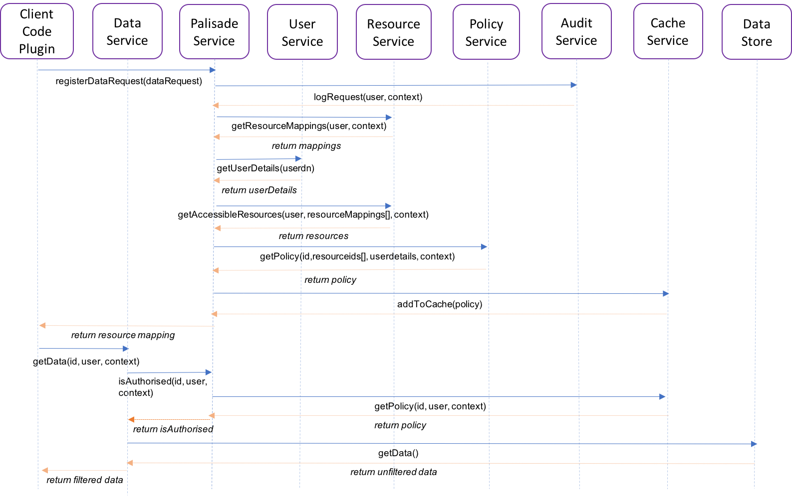

## Standard flow for a read request through the Palisade system

1. The user makes use of a plug-in (client code) for the data processing technology that they are using which makes it almost invisible to them that they are actually querying data via Palisade.

1. For a distributed workflow that client code will usually be made up of a driver component and an executor/mapper component. The driver component starts by registering the data request with the 
palisade service, stating the resources/alias mapping to resources that they want to query, along with a user id and any required context such as a purpose for querying the data.

1. The palisade service receives that request, authenticates the user and then sends a message to the audit service to log the request.

1. The palisade service then requests the mapping of how to connect to the relevant data service(s) to retrieve each of the resources requested. This may allow aliases which map to a list of resources, 
which would need to be resolved by the resource service.

1. The palisade service then requests the full details about the user from the user service.

1. The Palisade service requests the details of which of the resources the user is allowed to access at a resource level.

1. The palisade service then requests from the policy service the record level rules to be applied to each of the resources, passing in the full user details returned by the user service, 
any context passed in by the client code and the list of resources returned by the resource service.

1. The palisade service then caches the response from the policy service in the cache service, so that any palisade service can respond to the data server later on.

1. The palisade service then returns the resource to connection detail mapping of the resources that the user is allow to access to the client in response to the client registering the request.

1. The client code, having received the mapping of resource-to-connection details, can now split the resources up over its executors and then each executor can request each of the resources
from the relevant data service(s).

1. The data service receives the request to read a resource and passes that request to the palisade service to authenticate the request and provide the record level rules to be applied to that resource.

1. The palisade service responds to the data service by retrieving from the cache service the required details that was cached in step 8.

1. The data service uses the response to read the resource and apply the rules.

1. The filtered and transformed data is then streamed back to the client.

1. The client then formats the code in the way that the data processing technology expects the data, so the user's code can proceed as if Palisade was never there.