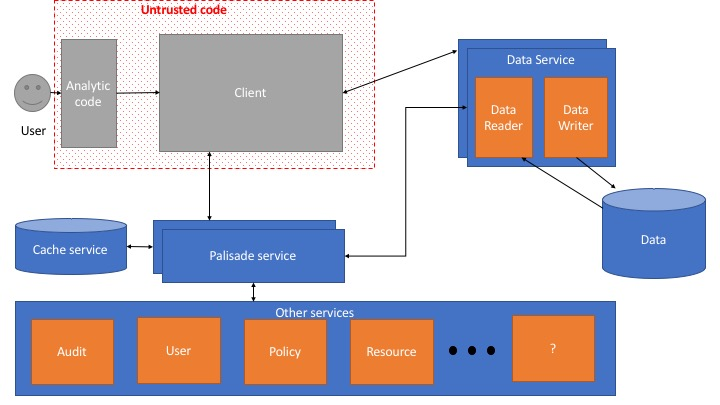
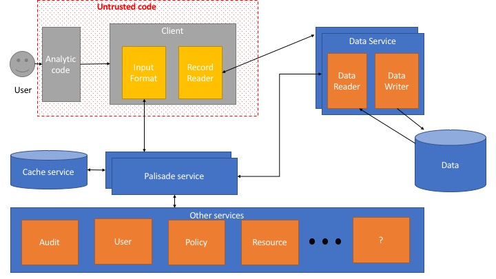
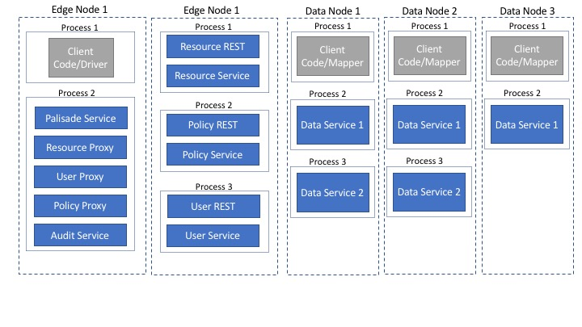
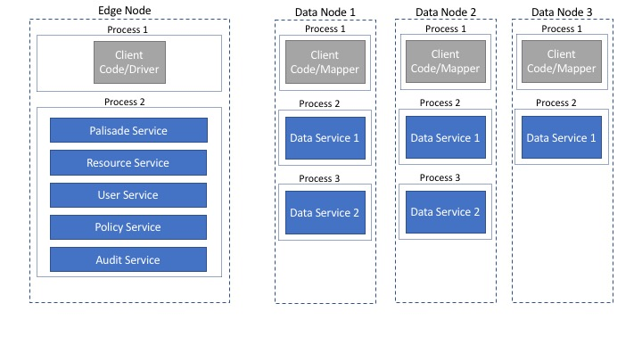

# Developer Guide

## Initial Requirements
#### Must have
* Can use a data access policy that is local, centralised corporately, or mix of both.
* Can use attributes about users to apply policies, with that user data being local, centralised corporately, or a mix of both.
* Can use attributes about justification for data access to apply policies, with that justification data being local, centralised corporately, or a mix of both.
* Policies can apply a list of rules, where a rule is a function on the record/resource, user and justification.
* Data can only be accessed via the approved mechanism.
* Request for data, and request completion status is logged for auditing centrally or locally (preferably without logging 1000s of times for each analytic's request, for example if you had 1000 mappers reading in parallel).
* Be able to write data behind Palisade in a way that minimises effort by user.
* Be a solution that works on data in motion and at rest.

#### Should have
* Be able to integrate new (storage or processing) technologies with minimal effort.
* Be able to deploy standalone(single machine); over a Hadoop cluster; or in a containerised environment (e.g Kubernetes).
* Maximise the parallelism and performance of the read/write operations.
* Allow for predicate pushdown to the data reader of the file format being accessed.
* Be able to redact/mask cells (different to redacting a column) rather than the entire record. Might just be a need to allow policy to dictate that data needs to be transformed when sent back to client.

#### Could have
* When data is written then a data lineage graph can be updated showing where the data came from.
* Data retention policies which are used to auto-delete data that has aged off or rewrite files to remove records that have been marked for purging on a given schedule (e.g. every night or once a month).

## Design Principles
* Reduce the work required to adopt new data processing and data storage technologies.
* The service and common modules should remain technology agnostic.
* Palisade should scale horizontally and enable monitoring, with the intention being to enable auto-scaling and auto-healing of each micro-service.
* Palisade should also make it easy to debug by enabling the tracing of a request through all the micro-services that make up Palisade.
* Minimise serialisation/de-serialisation by making use of Apache Arrow where sensible. 

## High level architectural diagram

## Description of each component
1. [Client code](#client-code)
2. [Palisade Service](#palisade-service)
3. [Data Service](#data-service)
4. [Audit Service](#audit-service)
5. [User Service](#user-service)
6. [Policy Service](#policy-service)
7. [Resource Service](#resource-service)
8. [Cache Service](#cache-service)

### Client code
The job of the client code is to send the request for data into Palisade and to interpret the result as required for the data processing technology it is written for.
The responsibility for implementations of the client code is to provide users with a way to request data from Palisade in a way that the user has to make minimal changes to how they would normally use that processing technology.
Implementations of this component will usually require deep understanding of the data processing technology in order to best hook into that technology, without needing to fork the code for that technology.

### Palisade Service
The palisade service is the main controller of the Palisade system. 
[Check out the palisade service readme for more details](../service/palisade-service/README.md)

### Data Service
The data service is responsible for connecting to the data and sanitising the data before streaming it back to the client.
[Check out the data service readme for more details](../service/data-service/README.md)

#### Data Reader
The job of the data reader is to read a single resource, serialise it into the format that the set of rules for this resource will expect and then apply those rules before passing the data back to the data service. The data reader should also be able to push down filters where appropriate to optimise the read process, e.g. to only retrieve certain columns from a columnar database or a particular row range.

### Audit Service
The audit service is responsible for recording audit logs as requested by other services.
[Check out the audit service readme for more details](../service/audit-service/README.md)

### User Service
The user service is responsible for retrieving details about the user from an authoritative source.
[Check out the user service readme for more details](../service/user-service/README.md)

### Policy Service
The job of the policy service is to provide the set of rules (filters or transformations) that need to be applied to each resource that has been requested, based on the user and justification.
[Check out the policy service readme for more details](../service/policy-service/README.md)

### Resource Service
The job of the resource service is to provide the detailed information about each resource based on a resource id (path/alias) being managed by Palisade. That extra information could be the type of data in that resource, when the resource was created, etc.
[Check out the resource service readme for more details](../service/resource-service/README.md)

### Cache Service
The job of the cache service is to provide a shared cache of the information that the data service is going to require about a read request that has been registered. 
[Check out the cache service readme for more details](../service/cache-service/README.md)

## High level architecture using a map reduce client

## Standard data flow through the Palisade system

1. The user makes use of a plug-in (client code) for the data processing technology that they are using which makes it almost invisible to them that they are actually querying data via Palisade.
2. For a distributed workflow that client code will usually be made up of a driver component and an executor/mapper component. The driver component starts by registering the data request with the palisade service, stating the resources/alias mapping to resources that they want to query, along with a user id and a justification for querying the data.
3. The palisade service receives that request and then sends an audit log message to the audit service to log the request.
4. The palisade service then requests the mapping of how to connect to the relevant data service to retrieve each of the resources requested. This may allow aliases which map to a list of resources, which would need to be resolved by the resource service.
5. The palisade service then returns the mapping to the client in response to the client registering the request
6. The palisade service then requests the full details about the user from the user service.
7. The palisade service then requests the policy to be applied to each of the resources, passing in the full user details returned by the user service, any justification passed in by the client code and the list of resources returned by the resource service.
8. The palisade service then caches the response from the policy service in the cache service, so that any palisade service can respond to the data server later on.
9. The client code, having received the mapping of resource-to-connection details, can now split the resources up over its executors and then each executor can request a subset of the resources from the relevant data service.
10. The data service receives the request to read a subset of the resources and passes that request to the palisade service.
11. The palisade service responds to the data service by retrieving from the cache service the response that was cached in step 8.
12. The data service uses the response to loop over all the resources to read the resource and apply the rules applicable to that resource.
13. The filtered and transformed data is then streamed back to the client.
14. The client then formats the code in the way that the data processing technology expects the data, so the user's code can proceed as if palisade was never there.

## How might the system be deployed?

#### Micro-service deployment using REST APIs

This deployment shows how you might have a Palisade service that can use a local audit service component but uses proxies to ask other micro-services for the other information that it requires. Those other micro-services could be running on different machines.
#### Monolith deployment

This deployment shows that it can still works if you want to have all of your services running in the same JVM.

## Roadmap for Palisade
#### Near term
* Create a data service broker that uses a queueing mechanism like ActiveMQ/RabbitMQ.
* Create a HDFS resource service.
* Create a MongoDB policy service.
* Create a HDFS text file data service.
* Create a HDFS CSV file data service.
* Create a HDFS Parquet data service.
* Create a HDFS Avro data service.
* Create command line tool client (so you can alias 'cat', 'grep', etc).
* Explore deployment methods (Ansible/Kubernetes).
* See if we can hook Palisade into Alluxio, so Alluxio can act as the client code.
* Create an Apache Spark client.
* Create a REST client to enable easier coded API access to data (Python/Java client).

#### Mid term
* Add support for pushing down user filters (predicate pushdown).
* Add write support to the palisade service so it updates the relevant policies, which are set ready to read data back out.
* Support Java 11+.

#### Long term
* Be able to update a data lineage graph which keeps track of what data sources were used to create this data set and what processing was done at each stage.
* Be able to manage the deletion of data (file/record/item level) to which Palisade is protecting the access, based on purge policies.

## Who do I talk to?

* Repo owner or admin
