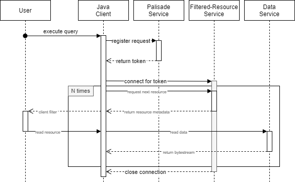
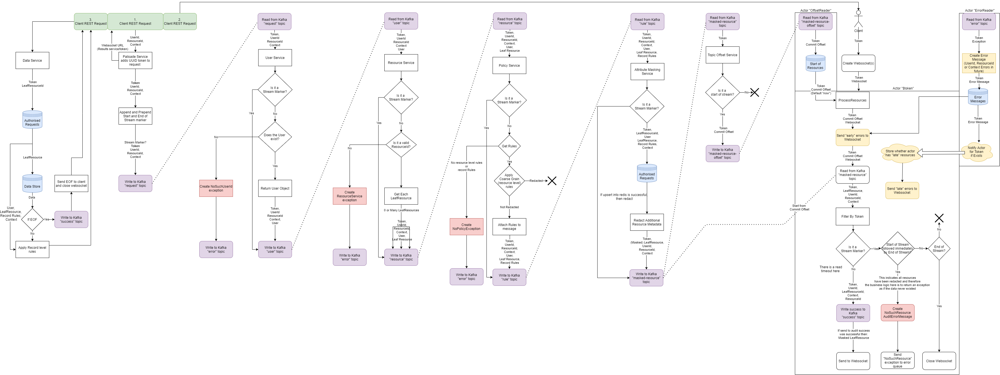

<!---
Copyright 2018-2021 Crown Copyright

Licensed under the Apache License, Version 2.0 (the "License");
you may not use this file except in compliance with the License.
You may obtain a copy of the License at

  http://www.apache.org/licenses/LICENSE-2.0

Unless required by applicable law or agreed to in writing, software
distributed under the License is distributed on an "AS IS" BASIS,
WITHOUT WARRANTIES OR CONDITIONS OF ANY KIND, either express or implied.
See the License for the specific language governing permissions and
limitations under the License.
--->

# Read Process
The full sequence of events for a client, eg. read a file through Palisade, is as follows:

1. A client will connect to the palisade service and receive a token.
1. This token will be used to connect to the filtered-resource service and receive many resources (and metadata for each resource).
1. The client may choose to do some filtering on this metadata for only the resources they are interested in.
1. Each resource is then read from the data-service, returning a stream of serialised bytes (which the client may then further deserialise etc.).

## Client Sequence Diagram

The above diagram shows the sequence of messages from the client's point-of-view, hiding the internals of the Palisade system.
This can be considered as the 'API' for Palisade.

## System Control-Flow Diagram

The above diagram shows the flow of control for a single request through the Palisade system.
Note the top-left trio of `Client xxx Request`s, each showing one of the interactions the client makes with the system.
