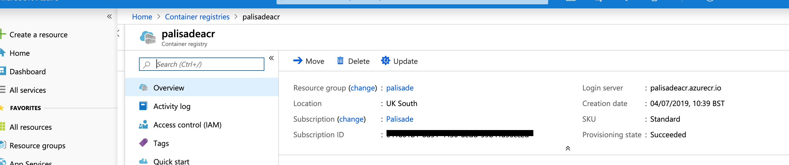
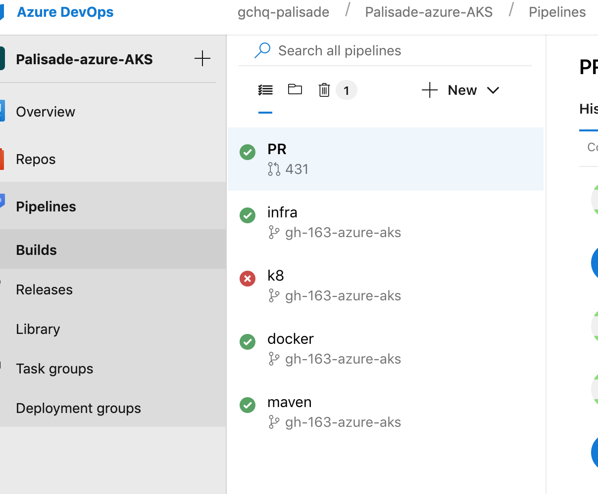

## Configuring Azure DevOps account
1. Under Azure Devops: https://dev.azure.com you should see an organisation representing where the palisade project should be hosted. If you see a valid organisation go to 3.
1. If you do not have a valid organisation, click on + New organisation and enter a name for the DevOps organization. "organisation name"
1. If you're not a member of the Project Collection Administrators Group,  [get added as one](https://docs.microsoft.com/en-us/azure/devops/organizations/security/set-project-collection-level-permissions?view=azure-devops). To create projects you must have the Create new projects permission set to Allow.
1. Create a project from the Azure DevOps web portal by following these [instructions](https://docs.microsoft.com/en-us/azure/devops/organizations/projects/create-project?view=azure-devops) 
1. Choose a meaningful project name such as **Palisade-azure-AKS**

### Creating the library
1. In order to use the Azure pipeline it is necessary to create a series of build assets for the project - Azure call the repository where this information is stored a *library*. Click on Library->+ Variable Group. Give the variable group a meaningful name such as Palisade-azure.
You will need to add in the following variables:
* subscription_id - follow this [instruction](https://blogs.msdn.microsoft.com/mschray/2016/03/18/getting-your-azure-subscription-guid-new-portal/) in order to obtain the *subscription id* for your particular subscription (A subscription is a selection of resources)
* terraform_sp_app_id - in order for terraform to be able to create resources, a service principal application and password must be created - follow these [instructions](https://docs.microsoft.com/en-us/azure/active-directory/develop/howto-create-service-principal-portal) in order to create an Azure AD application
* terraform_sp_pass - the password created above

Your library entry should appear as below:

1. Under the project click on pipelines - we are now going to configure all the build pipelines.
 
### Creating a container registry
The Infra Azure DevOps pipeline should create the container registry.
All docker images created as part of the build artefacts are stored in the azure container registry.
The infrastructure as code assumes that the name of the container registry will be *palisadeacr*
If the pipeline *does not* create the container registry then follow these [instructions](https://docs.microsoft.com/en-us/azure/container-registry/container-registry-get-started-portal) for creating it.
Shown below is the view of the container registry:

The *login server* entry should appear as: palisadeacr.azurecr.io 

### Adding builds 
Pipelines contain a series of builds - the builds we will create are defined as the following:

* *infra* - The main infrastructure build - essentially responsible for creating the kubernetes cluster and infrastructure used by the Palisade deployment
* *PR* - Joining together of the following build pipelines in this order: maven, docker, k8
* *maven* - Build all components of Palisade, publish the local docker example artefacts to the pipeline build environment ready for subsequent pipelines to use
* *docker* - Build and push all the palisade docker images to the azure container registry: The container registry pushed to is defined in [azure-pipelines.docker-template.yaml](devops-pipelines/azure-pipelines.docker-template.yaml) - currently set to: *azureContainerRegistry: 'palisadeacr.azurecr.io'*
* *k8* - kubernetes pipeline - performs the Azure kubernetes cluster update for the project.

1. Select *+ New* and select *New build pipeline*
1. Under Connect -> Where is your code? Select GitHub
1. Authorize Azure Pipelines via OAuth
1. Under *Select a repository* choose gchq/Palisade
1. Create the following builds:

* infra - `https://github.com/gchq/Palisade/blob/<branch>/example/deployment/Azure-AKS/devops-pipelines/azure-pipelines.infra.yaml`
* PR - `https://github.com/gchq/Palisade/blob/<branch>/example/deployment/Azure-AKS/devops-pipelines/azure-pipelines.pr.yaml`
* maven - `https://github.com/gchq/Palisade/blob/<branch>/example/deployment/Azure-AKS/devops-pipelines/azure-pipelines.maven.yaml`
* docker - `https://github.com/gchq/Palisade/blob/<branch>/example/deployment/Azure-AKS/devops-pipelines/azure-pipelines.docker.yaml`
* k8 - `https://github.com/gchq/Palisade/blob/<branch>/example/deployment/Azure-AKS/devops-pipelines/azure-pipelines.k8s.yaml`

The build view should now appear as below:

