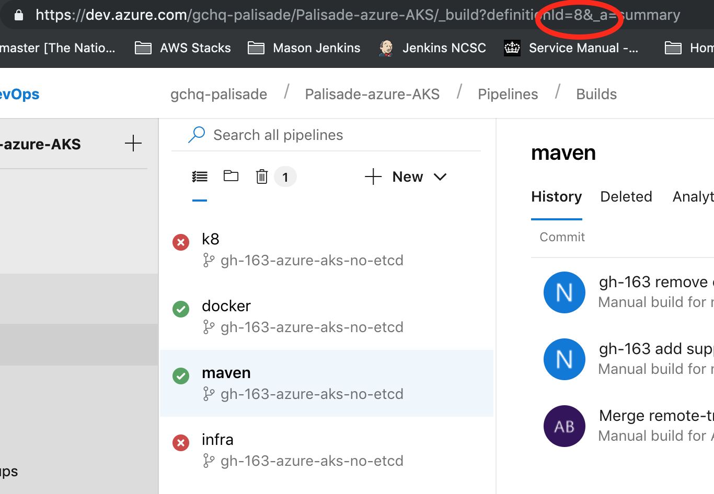
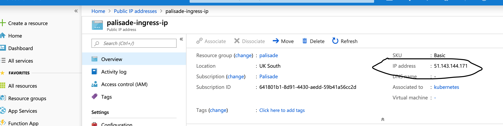

# Azure AKS Example

This example demonstrates how to deploy Palisade within the Azure Kubernetes service using the Azure DevOps pipelines to automate the deployment process and then to run the example.
The pre-requisites of this example are:
- Azure subscription
- Azure service principle with contributor access permissions on your subscription
- Azure DevOps account

##Configuring the Azure DevOps account: 
[devOps](./ConfigureAzureDevOPS.md)

N.B The pipeline id (*'pipeline:'*) defined in the following files:
/Palisade/example/deployment/Azure-AKS/devops-pipelines/azure-pipelines.docker-template.yaml
refers to a given devops setup.
The documentation [here](https://docs.microsoft.com/en-us/azure/devops/pipelines/tasks/utility/download-build-artifacts?view=azure-devops) describes the build artefacts.
Currently this file contains the pipeline id == 8. This is the pipeline for *maven*
The pipeline id can be found as shown in the diagram below:


##Pipelines to execute to build and deploy the example
The order of executing the pipelines should be as follows:
1. *infra* - Create the main infrastructure
1. *maven* - Build all components of Palisade
1. *docker* - Build and publish all the palisade docker images
1. *k8* - Perform the Kubernetes cluster update

##Checking Palisade deployed correctly
1. Open the Microsoft Azure Cloud Shell by following these [instructions](https://docs.microsoft.com/en-us/azure/cloud-shell/quickstart)
1. The following [documentation](https://docs.microsoft.com/en-us/azure/aks/kubernetes-walkthrough) is useful for explaining how to create an Azure Kubernetes Cluster. For this example that creation is done by the 'Infra' pipeline.
1. Run the following command in the command shell:
( This command downloads credentials and configures the Kubernetes CLI to use them.)
```bash
user@Azure:~$ az aks get-credentials --resource-group palisade --name palisade-aks
Merged "palisade-aks" as current context in /home/<user>/.kube/config
user@Azure:~$
```
1. If all is well, you can now issue the following command and see the status output:

```bash
user@Azure:~$ kubectl get pods
NAME                                READY   STATUS      RESTARTS   AGE
config-service-79868dd5b6-hkj7k     1/1     Running     0          114m
configure-example-98qmj             0/1     Completed   0          114m
configure-services-9mp2r            0/1     Completed   0          114m
data-service-64f596c6b9-bfcs4       1/1     Running     0          114m
data-service-64f596c6b9-cbr9t       1/1     Running     0          114m
data-service-64f596c6b9-h8h68       1/1     Running     0          114m
data-service-64f596c6b9-r86w5       1/1     Running     0          114m
data-service-64f596c6b9-rsftk       1/1     Running     0          114m
etcd-fcdf6b9f4-xlsgp                1/1     Running     1          27h
palisade-service-c98d8b7c-kc9vr     1/1     Running     0          114m
policy-service-6594d845db-dg2fm     1/1     Running     0          114m
resource-service-79487d98d8-s5jpk   1/1     Running     0          114m
user-service-96d9dd769-kmrrt        1/1     Running     0          114m
user@Azure:~
```

Note how all services indicated they are up and healthy.

##Client VM
Create a virtual machine named *client-vm* with the following specification
* Linux (ubuntu 18.04)
* Standard D4s v3 (4 cpus, 16GiB memory)
* public IP - new
* 30GB Premium SSD OS disk
* No data disk
* virtual network: new
* inbound port rule SSH 22 TCP source: Any, destination: Any
* AllowVnetInBound Any port, Any protocol source: Virtual Network, destination: Virtual Network
* AllowAzureLoadBalancerInBound Any port, Any protocol source: AzureLoadBalancer, destination: Any, Action: Allow
* DenyAllInBound Any port, Any protocol, Any source, Any destination, Action: Deny

Mount the filestorage by following these [details](https://docs.microsoft.com/en-us/azure/virtual-machines/linux/mount-azure-file-storage-on-linux-using-smb) 
and mount the disk to /data

Running the following command should produce the following:

```bash
client@client-vm:~$ df -a | grep 'data\|Filesystem'
Filesystem                                   1K-blocks     Used Available Use% Mounted on
//palisadestorage.file.core.windows.net/data 524288000 96349504 427938496  19% /data
```

Checkout the Palisade repository:
```bash
git clone https://github.com/gchq/Palisade.git
cd Palisade && git checkout <branch>
```

##Modify /etc/hosts on the client VM
Obtain the ingress public IP:



```bash
vim /etc/hosts
<ingress public ip> config-service palisade-service data-service
```

##Generate the test data 

Use the following command to create a test data set:

```bash
java -cp Palisade/example/hr-data-generator/target/hr-data-generator-*-shaded.jar uk.gov.gchq.palisade.example.hrdatagenerator.CreateData /data/testData/ <number of records> <number of files to split records over> <number of threads to use> &
```

##Run the test example:
This example only uses a single threaded java client to read the resources one at a time and, therefore is not taking advantage of distributed client technologies yet.

```bash
java -cp Palisade/example/example-model/target/example-model-*-shaded.jar -DPALISADE_REST_CONFIG_PATH=Palisade/example/deployment/Azure-AKS/configRest.json uk.gov.gchq.palisade.example.runner.RestExample /data/testData 
example.runner.RestExample INFO  - Going to request /data/testData from Palisade
example.runner.RestExample INFO  - 
example.runner.RestExample INFO  - Alice [ ExampleUser[userId=UserId[id=Alice],roles=[HR],auths=[private, public],trainingCourses=[PAYROLL_TRAINING_COURSE]] } is reading the Employee file with a purpose of SALARY...
setting original request id: RequestId[id=6c111aee-2a13-443f-aa19-391aaf014269]
example.runner.RestExample INFO  - Alice got back: 

```
