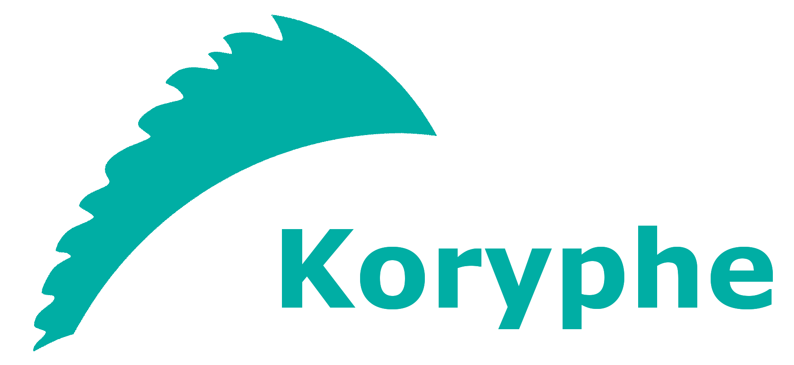

<!---
Copyright 2018 Crown Copyright

Licensed under the Apache License, Version 2.0 (the "License");
you may not use this file except in compliance with the License.
You may obtain a copy of the License at

  http://www.apache.org/licenses/LICENSE-2.0

Unless required by applicable law or agreed to in writing, software
distributed under the License is distributed on an "AS IS" BASIS,
WITHOUT WARRANTIES OR CONDITIONS OF ANY KIND, either express or implied.
See the License for the specific language governing permissions and
limitations under the License.
--->


# Koryphe Library

This library adds Koryphe Functions/Predicates to Palisade.



[Koryphe](https://github.com/gchq/koryphe) provides several lightweight 
reusable functions and predicates that can be chained together and applied
to generic tuple objects. Using this library allows you to define your
Palisade Policy rules in standard reusable way without having to
create lots of similar java classes. It also provides a mechanism
for extracting fields from objects/tuples and passing them directly to
functions/predicates.

This allows commonly used Koryphe functions, such as `IsMoreThan`, to be applied against a record's field, such as timestamp, without having to implement and create new java functions in the code.

### Without Koryphe Rules 
Each rule must be implemented in code like with the below example from [IsExampleObjRecent](https://github.com/gchq/Palisade/blob/master/example/example-model/src/main/java/uk/gov/gchq/palisade/example/rule/IsExampleObjRecent.java "IsExampleObjRecent"). 

```java
public class IsExampleObjRecent implements Rule<ExampleObj> {
    private long threshold;

    public IsExampleObjRecent() {
    }

    public IsExampleObjRecent(final long threshold) {
        this.threshold = threshold;
    }

    @Override
    public ExampleObj apply(final ExampleObj record, final User user, final Justification justification) {
        if (null == record) {
            return null;
        }

        final boolean isRecent = record.getTimestamp() > threshold;
        return isRecent ? record : null;
    }
}
```

In the this example the threshold value is passed in at the `constructor` and the `>` logic is implemented within the `apply()` method, but this method is also responsible for getting the correct field from the record `ExampleObj.getTimestamp()`.
To implement the same logic against either a different field or object, would require a new implementation of a similar class with duplicated logic.

### Using Koryphe Rules
The logic of a Koryphe predicate rule is reusable, because only threshold value and the field selection/projections changes.

#### Predicates
The below example from [ExampleSimpleClient](https://github.com/gchq/Palisade/blob/master/example/single-jvm-example/single-jvm-example-client/src/main/java/uk/gov/gchq/palisade/example/client/ExampleSimpleClient.java "ExampleSimpleClient") shows a rule named "2-ageOff". This rule applies the `IsMoreThan` function with a threshold of 12, against the "timestamp" field within a Record object. To apply the same rule against another field or object only the selection argument needs to be changed.
```java
new TupleRule<ExampleObj>()
    .selection("Record.timestamp")
    .predicate(new IsMoreThan(12L))
```


##### Nested Selection
The Koryphe rules are applied against a tuple with named fields (or by default wrapped in a inefficient Reflective Tuple). This allows selecting nested fields within a record or object, i.e. `select("library.room.shelf.book.paragraph.sentence.word")`, without having to implement the logic within Java code, provided the fields or getMethods for the structures are public.

#### Functions
The below example is how Koryphe rules can be used to manipulate a record. In this case we are setting 'new value' on the record. 
```java
new TupleRule<ExampleObj>()
    .selection("Record.value1")
    .function(new SetValue("new value"))
    .projection("Record.value1")
```
* A **selection** is made "Record.value1" (in this example the selection isn't used)
* A **predicate** is applied, in this example the there is no logic other that a value is created "new value"
* Output is written to the **projection**, in this example the projection is the same as the original selection "Record.value1"

#### If Logic
The below example from [ExampleSimpleClient](https://github.com/gchq/Palisade/blob/master/example/single-jvm-example/single-jvm-example-client/src/main/java/uk/gov/gchq/palisade/example/client/ExampleSimpleClient.java "ExampleSimpleClient") shows how decision logic can be applied using Koryphe rules. 
```java
new TupleRule<>(ExampleObj)
        .selection("User.roles", "Record.property"),
        .function(new If<>()
            .predicate(0, new Not<>(new CollectionContains("admin")))
            .then(1, new SetValue("redacted"))
```
The selection has two values `selection("User.roles", "Record.property")` these can be referenced within the `If` function by their respective keys (0,1).
In the example the predicate is applied against the '0' selection "User.roles", when evaluated as true the function within the ".then" method is executed otherwise the function in the ".otherwise" function (not shown in the example.) This examples shows the value "redacted" being written to the selection '1'/"Record.property".
