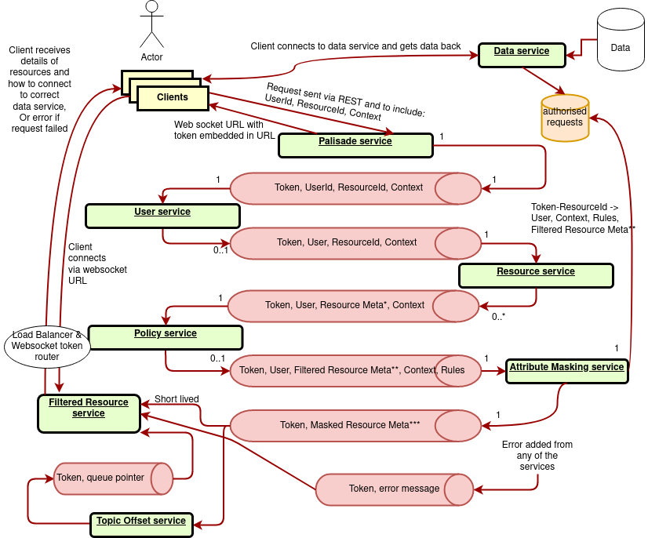

<!---
Copyright 2020 Crown Copyright

Licensed under the Apache License, Version 2.0 (the "License");
you may not use this file except in compliance with the License.
You may obtain a copy of the License at

  http://www.apache.org/licenses/LICENSE-2.0

Unless required by applicable law or agreed to in writing, software
distributed under the License is distributed on an "AS IS" BASIS,
WITHOUT WARRANTIES OR CONDITIONS OF ANY KIND, either express or implied.
See the License for the specific language governing permissions and
limitations under the License.
--->

# Component Descriptions

## Message Sequence through the Palisade System

The above shows how messages might travel, and which services talk to which others.

### Clients
The job of the client code is to send the request for data into Palisade and to interpret the result as required for the data processing technology it is written for.
The responsibility for implementations of the client code is to provide users with a way to request data from Palisade in a way that the user has to make minimal changes to how they would normally use that processing technology.
Implementations of this component will usually require deep understanding of the data processing technology in order to best hook into that technology, without needing to fork the code for that technology.

### Palisade Service
The Palisade Service is the entry-point to the Palisade system.
A client will register a request with the Palisade Service and be returned a token, which will uniquely identify their request - e.g. to the Filtered-Resource Service and Data Service.

### User Service
The User Service is responsible for retrieving details about the user from an authoritative source.
This may be an LDAP User Service, Amazon Cognito, or any other User Service provider.

### Resource Service
The Resource Service is responsible for providing the detailed information about each resource based on a resource id (path or alias) being managed by Palisade.
The detailed information the service provides could be the type and format of data in that resource, when the resource was created, additional access controls, data lifetime and expiry, categorisation and tagging, etc.

### Policy Service
The Policy Service is responsible for providing a mapping from resources to a set of rules (filters or transformations) that need to be applied, based on the user and query context.
The service itself manages additional hierarchical logic, such that rules applied to parent resources are also applied to their children.

### Attribute-Masking Service
The Attribute-Masking Service persists the provided context for an authorised data read, that is the token and resource id are used as a key and the user, resource, context and rules as a value.
This will later be queried by the Data Service.
The service then decides what metadata attached to resources is returned to the client.

### Topic-Offset Service
The Topic-Offset Service can be thought of as a basic performance optimisation to prevent reading through the whole kafka queue repeatedly.
The Topic-Offset Service watches the output of the Attribute-Masking Service, decides if a message indicates the start of a set of results for a token, and if so will record this position.
This will be used later by the Filtered-Resource Service for connecting to the queue in this exact position.

### Filtered-Resource Service
The Filtered-Resource Service is an exit-point from the Palisade system.
A client will connect to the Filtered-Resource Service with their token and receive a stream of resource metadata back.
Each of these responses can be requested from the Data Service, which will return the data records.

### Data Service
The Data Service is responsible for returning requested record data to the client.
This further involves validating the request, gathering the required trusted information (rules and the context in which to apply them) from the Attribute-Masking Service, and auditing what data was returned.

#### Data Reader
The job of the Data Reader is to read a single resource, de-serialise it into the format that the set of rules for this resource will expect and then apply those rules before passing the data back to the Data Service.
The Data Reader should also be able to push down filters where appropriate to optimise the read process, e.g. to only retrieve certain columns from a columnar database or a particular row range.
It is this component that is unique to each data storage technology, not the Data Service as a whole.

### Audit Service
The Audit Service is responsible for recording audit logs as requested by other services.
The audit logs produced by the services should be verbose by default.
They will then be filtered, organised and reduced by the Audit Service.
